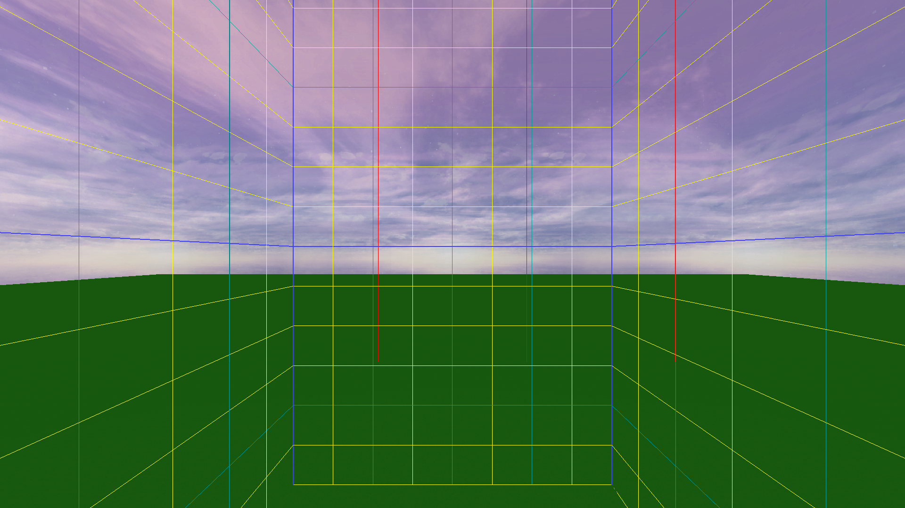
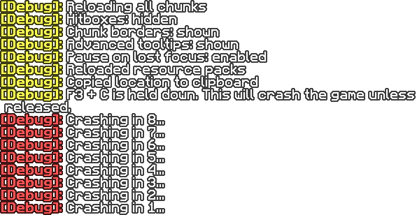
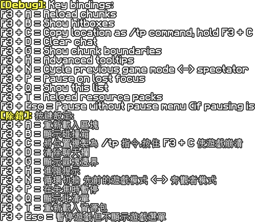

# ModernF3

Backport F3 features from modern versions.

## Features

- Chunk borders
- Copy location as /tp
- Debug messages
- KeyBinding fixes
- Render distance control
- Singleplayer pause screen

## Screenshots

Chunk Borders

Debug Messages

All Languages Translation

